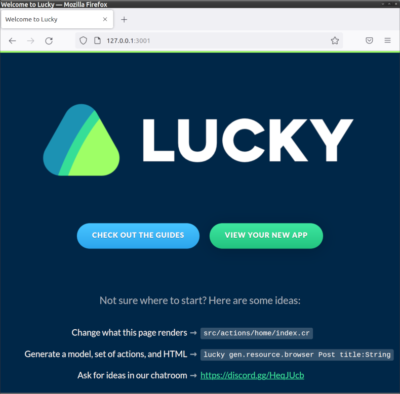
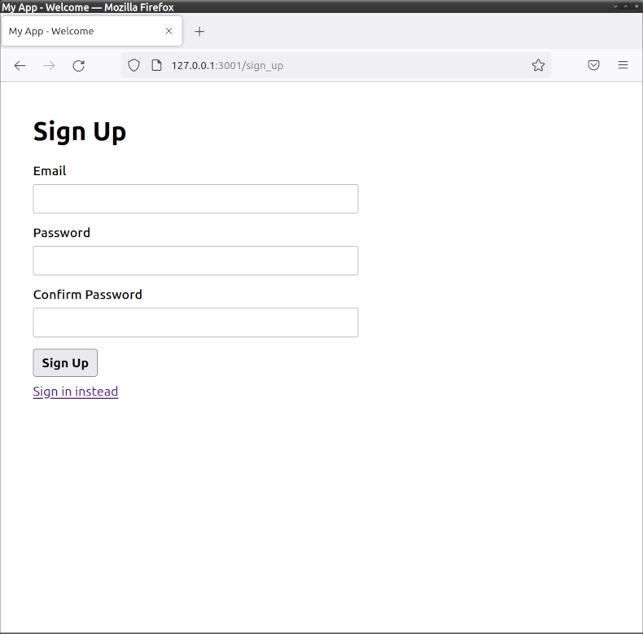
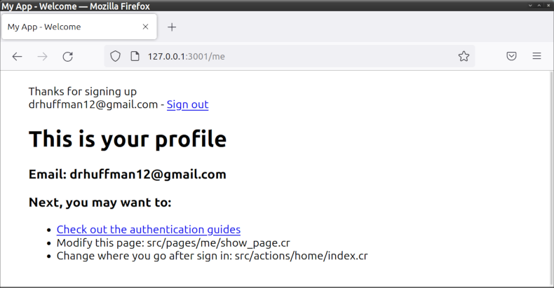

# example_lucky_app2

This is an example dockerized Lucky Framework app, initialized as an `full` (not `api` only) app and with default auth set up.

TODO:
- [ ] Unpend/resolve the 3 pend'ed tests (db conn issues).

## USAGE
* Clone (or fork) this repo, e.g.:
  ```
  git clone git@github.com:drhuffman12/example_lucky_app.git $MY_LUCKY_APP_NAME
  cd $MY_LUCKY_APP_NAME
  ```

* Remove/rename the README.md file and/or replace with your own, e.g.:
  ```
  mv README.md README.OLD.md
  echo "# $MY_LUCKY_APP_NAME" > README.md
  ```

* [Optionally] Clear/reset the git history and push it to either:
  * a new repository on the command line
    ```
    git init
    git add .
    git commit -m "first commit"
    git branch -M master
    git remote remove origin
    git remote add origin git@github.com:$YOUR_GITHUB_USER/$MY_LUCKY_APP_NAME.git
    git push -u origin master
    ```
  * an existing repository from the command line
    ```
    git remote add origin git@github.com:$YOUR_GITHUB_USER/$MY_LUCKY_APP_NAME.git
    git branch -M master
    git push -u origin master
    ```

* If you're using github, check your repo's workflow at: https://github.com/drhuffman12/my_lucky_app/actions

* Add your migrations/scaffolds/tests/etc, as desired.

---
## Build the container image and launch it
* `docker-compose build`
* `docker-compose up -d`

NOTE: Before re-building the container, you'll need to run the following to clean up after Overmind:

* `script/docker_cleanup_before_next_build.sh`

After initial loading of the Lucky app, it will show the default home page (http://localhost:3001/), which will have the following text:

```markdown
LUCKY

[CHECK OUT THE GUIDES](https://luckyframework.org/guides) | [VIEW YOUR NEW APP](http://localhost:3001/sign_up)

Not sure where to start? Here are some ideas:

Change what this page renders -> [src/actions/home/index.cr](src/actions/home/index.cr)

Generate a model, set of actions, and HTML -> `lucky gen.resource.browser Post title:String`

Ask for ideas in our chatroom -> [https://discord.gg/HeqJUcb](https://discord.gg/HeqJUcb)
```



If you click on [VIEW YOUR NEW APP](http://localhost:3001/sign_up), it will take you to a page that asks you to create a user and which will have the following text:

```markdown
# Sign Up
Email
[                ]
Password
[                ]
Confirm Password
[                ]
[Sign Up]
[Sign in instead](http://localhost:3001/sign_in)
```



After creating a user, it will take you to the `me` profile page, which will have text like the following:

```markdown
drhuffman12@gmail.com - Sign out

# This is your profile

Email: drhuffman12@gmail.com
Next, you may want to:
* Check out the authentication guides
* Modify this page: src/pages/me/show_page.cr
* Change where you go after sign in: src/actions/home/index.cr
```



---
## Running tests

From the Host OS terminal, open a terminal into the container's image:
* `docker-compose run app bash`

From the Container's terminal, enter the following to run the tests:
* `crystal spec`

---
## Versioning

* To update the version, edit the `shard.yml` file's `version` value.

* To view the version, run the `lucky my_app_task.version` task.
